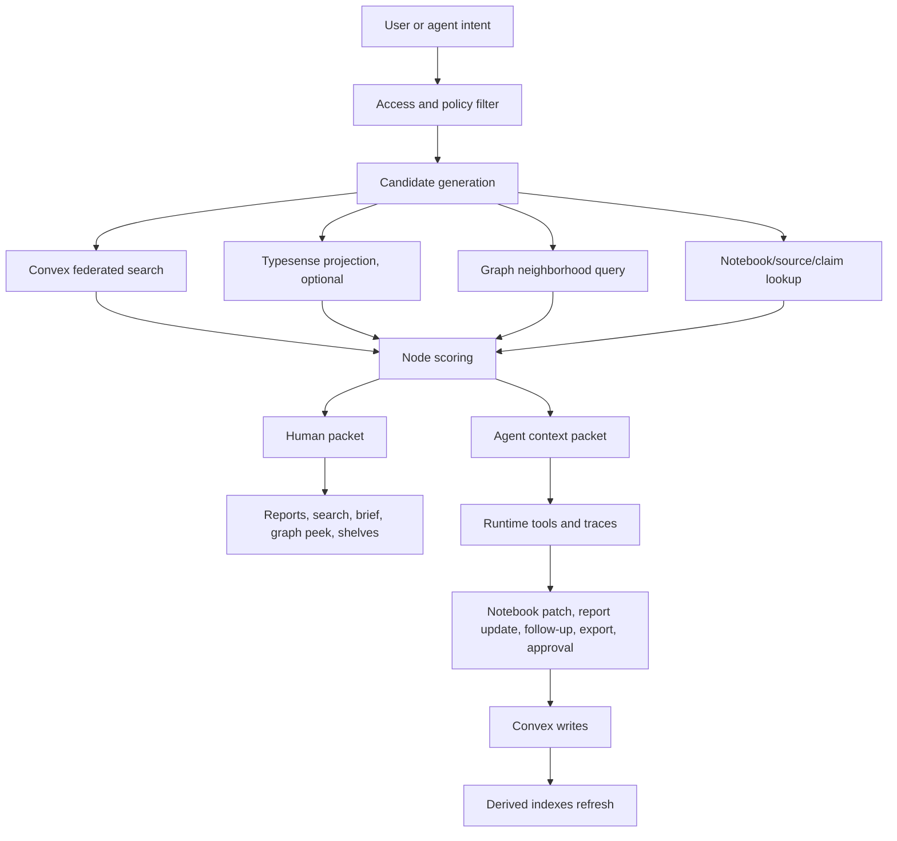

# Graph Search and Agent Context

**Status:** Active addendum. Last reviewed 2026-05-15
**Owner:** NodeBench product and agent runtime
**Supersedes:** None

## TL;DR

The NodeBench graph is not the product by itself. It is the retrieval and context
layer behind search, reports, notebooks, daily briefs, agent runs, and evidence
review.

Humans and agents should use the same memory substrate but at different levels
of granularity:

- Humans need high-scent, low-cognitive-load surfaces: reports, briefs, entity
  pages, search results, evidence drawers, relationship shelves, and small
  graph peeks.
- Agents need richer retrieval packets: keyword, BM25, semantic candidates,
  graph neighbors, source paths, claims, contradictions, tool handles, action
  handles, policies, and context-budget metadata.

The implementation rule is:

```text
Convex = source of truth
Typesense or equivalent = optional fast read/search projection
Graph = bounded context selector
UI = curated presentation, never raw full-graph dumping
Agent = budgeted context consumer with traceable tool actions
```

The visible browser graph should stay small, usually 50 to 120 nodes. The
logical graph can grow to hundreds of thousands or millions of nodes, but the
frontend should only render task-shaped neighborhoods and ranked node sets.

## The Questions That Created This Memo

The following prompts are preserved verbatim from the product discussion so
future agents can recover the actual intent, not just the cleaned-up conclusion.

### Graph parity and hierarchy

> not everything has been revamped and updated deliberately. what about the graphs ?

> how is it live wired ? and check again against home-v3.html because we are still constantly updating the home-v3.html as we move

> loop again, check the home-v3.html ,  make the graph real

> does not look like we reached exact parity, did you go back and forth to cross check against the home-v3.html?

> cross check again and check for any new gaps based on latest changes and updates

> cross check again and keep on updating for parity, parallel subagent deep read these documents and changes as well, visually contrast and compare:

> also consider what if one artifact had one or multiple correlations and causations

### Scale and graph messiness

> now how do we address the issue where we have messy nodes when we reach more than let's say thousands or dozens of thousands ? what are all ways that we can do that as a frontend engineer ?

> implement

> okay continue with the next boundary

### Agent runtime and tool context

> how does it tie to the logics with how our agent and its runtime tool sets skills and contexts

> is this the best way for us to proceed with the implementation, what do other top inspirational references utilize or perform for their graphs? are we doing extra unnecessary work by composing our own graph solutions? have we considered performance, cost, and maintainability?

> can we do a calculation using parallel subagent deep dive based on the past commits, and the directional growing changes, how many nodes within the graph are we projecting to grow into ?

> at the end of the day, these graphs are built for easier convex federated or typesense snappy search feeling for humans and the agents for context gathering. the goal for the human and the agents are similar in nature but different in granularity. human prefer the inferface that which the information is presented, ie like straight up the whole report, and they might be search with like kw match or bm25 match or something, meanwhile, agents might go above and beyond with the hybrid of kw, bm25, semantic, graph, links, etc.

> also, we are mainly tryna focus our attention on the nodes that does really matter, spawn up multiple agents to act like a group of PHD human psychological behavioral linguist that is aiding in product and UI UX design research

> thoroughly document this and all findings and discussions with the exact questions i had throughout the past, implement

### Adjacent release-readiness prompts that shaped the bar

> did you parallel subagent dive through all rows to test the product ?

> close all gaps and loop again and again until we satisfy our qa matrix

> why did you not automatically root cause address fix or implement so that we have full public release readiness?

> nothing can be truly blocked, you can engineer a solution or a way to resolve it including authenticated seeded data, think of yourself like a senior full stack engineer or a CTO, you would not jsut stop and say you are blocked

> it is not only home page, review all pages for where the product redesign loop fits, but only precisely shake things up where necessary ontop of existing implementations and UI UX look and feels

> none of the CENTER sections reached parity in the report, chat, me, inbox pages

> what happened to the centering, empty space, and everything

> who actually reads this ? this does not make sense to the users or audiences who are visiting, how is our agent utilized full force here ?

> rigidly and deliberately test each and every single point of contact passive or active that involves the agent, rigorously evaluate and judge the UI UX as well as the agent pipeline itself to find any issues or gaps compared to top referenceable apps or source of truth. your goal is defined by yourself, you are to manifest parallel subagents for being the CTO CMO CEO PM and Designer

These questions imply that graph work must not be treated as a decorative UI
slice. It has to close the loop between product presentation, retrieval quality,
agent context, runtime traceability, and the review workflow.

## Prior Art

This design borrows patterns, but not implementation obligations, from:

- Typesense federated search, facets, and hybrid keyword/vector search:
  https://typesense.org/docs/30.2/api/federated-multi-search.html
- Typesense scoped search keys for access-bounded search:
  https://typesense.org/docs/30.1/api/api-keys.html
- Information foraging and information scent, especially Pirolli and Card's
  framing that users follow cues that predict value:
  https://www.nngroup.com/articles/information-scent/
- Bates berrypicking model, where search evolves through partial discoveries
  instead of one static query:
  https://pages.gseis.ucla.edu/faculty/bates/berrypicking.html
- Neo4j Bloom perspectives, which hide irrelevant graph complexity through
  role-specific views:
  https://neo4j.com/docs/bloom-user-guide/current/bloom-perspectives/
- Sigma.js and Cosmograph for WebGL graph rendering when visible graphs exceed
  what SVG/React can comfortably render:
  https://www.sigmajs.org/ and https://cosmograph.app/
- React Flow for workflow DAGs and agent run diagrams, not dense knowledge
  graphs:
  https://reactflow.dev/
- Linear for operational state clarity and activity traces:
  https://linear.app/
- Notion database views for switching between gallery, board, table, and page
  reading modes:
  https://www.notion.com/help/galleries
- Heptabase, Miro, Milanote, and Readwise Reader for research cards, evidence
  organization, whiteboard/canvas clustering, and resurfacing important
  highlights.

The key synthesis is that NodeBench should own its graph semantics and ranking
rules, but should avoid building an unnecessary million-node browser renderer
unless the visible product really requires it.

## Invariants

1. Convex remains the source of truth for reports, entities, notebooks, sources,
   claims, runs, permissions, and mutations.
2. Search indexes are derived. Typesense or another index can be used for speed,
   but it must not own canonical state.
3. The frontend never renders the full graph. It renders a selected, explainable
   neighborhood.
4. The agent never receives an unbounded graph dump. It receives a budgeted
   context packet with handles, evidence, actions, policies, and on-demand refs.
5. Nodes visible to a human must carry information scent. A node is visible only
   if it helps the user choose what to read, verify, patch, export, monitor, or
   ask next.
6. Nodes included for an agent must improve retrieval, reasoning, or safe tool
   execution. Internal scratchpads, embeddings, cache keys, and prompt internals
   remain agent-only or hidden.
7. Every context resolution must be traceable. The user should be able to see why
   a report, source, claim, or entity entered the packet.
8. Privacy boundaries are enforced before ranking, rendering, or agent packing.
9. The graph is a product navigation aid and an agent context aid. It is not a
   replacement for reports, notebooks, source review, or search.

## What The Graph Is For

### For humans

Humans use graph-derived information to answer:

```text
What is this connected to?
Why does this matter?
Which report should I open?
Which sources support this?
What changed since last time?
What should I review next?
```

Human presentation should usually be:

- A full report or notebook, not a node soup.
- A relationship shelf under an entity or report.
- A small graph peek showing only high-value neighbors.
- A Daily Brief section that says which reports, entities, and evidence rows
  were touched.
- A search result packet with facets, highlights, sources, and next actions.

### For agents

Agents use graph-derived information to answer:

```text
What context already exists?
Which report is the right write target?
Which sources support or contradict this claim?
What can be safely patched?
What requires approval?
Which tool should be called next?
```

Agent presentation should usually be:

- Typed handles, not raw text only.
- Evidence-backed claims with source refs.
- Relationship paths and graph distance.
- Contradiction packets.
- Allowed actions and blocked actions.
- Context budget metadata.
- On-demand refs for deeper expansion.

## Architecture



The same retrieval system can serve both UI and agents, but it must expose
different contracts.

### Human contract

```ts
type HumanSearchResult = {
  uri: string;
  type: "report" | "entity" | "source" | "claim" | "thread" | "artifact";
  title: string;
  subtitle?: string;
  snippet: string;
  highlights: string[];
  facets: string[];
  sourceCount?: number;
  claimCount?: number;
  freshness?: string;
  confidence?: number;
  whyShown: string[];
  actions: Array<"open" | "ask" | "review" | "patch" | "export" | "monitor">;
};
```

### Agent contract

```ts
type AgentContextNode = {
  uri: string;
  type: string;
  title: string;
  summary: string;
  visibility: "private" | "team" | "public_cache";
  scope: {
    tenantId: string;
    workspaceId?: string;
    userId?: string;
    companyId?: string;
  };
  confidence: number;
  freshness: number;
  version: number;
  lineage: string[];
  claims: Array<{
    claimUri: string;
    text: string;
    verificationStatus: "verified" | "needs_review" | "contradicted";
    evidenceRefs: string[];
  }>;
  sourceRefs: string[];
  evidenceRefs: string[];
  graphPaths: Array<{
    from: string;
    to: string;
    edgeTypes: string[];
    distance: number;
  }>;
  allowedActions: string[];
  blockedActions: string[];
  approvalRequired: boolean;
  onDemandRefs: string[];
  whySelected: string[];
};
```

## Search And Retrieval Flow

Use two high-level retrieval tools, not a wide set of low-level graph controls:

```ts
search_memory({
  q,
  collections,
  filters,
  mode: "human" | "agent",
  limit,
});

resolve_report_graph_context({
  rootUri,
  q,
  filters,
  mode: "human" | "agent",
  budget,
});
```

Human mode optimizes for readable presentation. Agent mode optimizes for
evidence completeness, graph proximity, action readiness, and low token cost.

### Candidate generation

Candidate generation should combine:

- Exact entity match.
- Alias match.
- Keyword/BM25 match.
- Semantic match.
- Graph neighborhood.
- Prior chat/session context.
- Notebook mention.
- Source citation and content-hash lookup.
- Watchlist/user memory match.
- Active task/run context.

### Ranking formula

Ranking starts after access control:

```text
Eligible(n,u) =
  access_ok(n,u) * not_deleted(n) * policy_ok(n)

BaseScore(n) =
  0.18 * Sparse(q,n)
+ 0.16 * Dense(q,n)
+ 0.18 * GraphProximity(n,F)
+ 0.18 * Grounding(n)
+ 0.12 * TaskActionability(n,t)
+ 0.08 * SourceTrust(n)
+ 0.06 * Freshness(n,t)
+ 0.04 * SessionContinuity(n)

Penalty(n) =
  0.25 * Duplicate(n)
+ 0.20 * StaleForIntent(n,t)
+ 0.30 * UncitedFactualClaim(n)
+ 0.20 * ContradictionUnresolved(n)
+ 0.15 * HighCostLowSignal(n)

NodeScore(n) =
  Eligible(n,u) * max(0, BaseScore(n) - Penalty(n))
```

Packing is then budget-aware:

```text
PackScore(n | S) =
  NodeScore(n)
  * CoverageGain(n, q, t)
  * Novelty(n, S)
  * DependencyCompleteness(n)
  / TokenCost(n)^0.7
```

Dependency rules:

- If packing a claim, include at least one evidence chunk.
- If packing an evidence chunk, include source metadata and content hash.
- If packing a contradiction, include both sides.
- If packing a tool/action handle, include schema handle and next-action hint.
- If packing a notebook patch, include target section and edit safety status.

## Human Attention Model

The behavioral product rule is:

```text
Show nodes that change belief, priority, or next action.
Hide nodes that only prove the system has a lot of data.
```

Use this attention rubric from the product/research discussion:

```text
Attention Value =
  Goal Relevance
+ Consequence
+ Novelty
+ Evidence Strength
+ Relational Leverage
+ Actionability
+ Uncertainty Value
- Cognitive Cost
```

Each dimension is scored 0 to 3:

| Dimension | Meaning |
|---|---|
| Goal relevance | Does this help the user's current job? |
| Consequence | Would ignoring it create real cost or missed upside? |
| Novelty | Is it meaningfully new relative to memory? |
| Evidence strength | Is it backed by trusted sources, citations, or hashes? |
| Relational leverage | Does it explain or connect multiple other objects? |
| Actionability | Can the user do something with it now? |
| Uncertainty value | Is resolving this uncertainty valuable? |
| Cognitive cost | How much visual or mental load does it add? |

Practical thresholds:

- 9+ after cognitive cost: visible in main surface.
- 6 to 8: visible in a shelf, drawer, graph peek, or search result.
- 3 to 5: searchable or on-demand.
- Under 3: hidden metadata or agent-only.

## Node Promotion Policy

### First-class visible nodes

Promote these to visible nodes when identity and access are clear:

- Companies, organizations, people, products, events, topics, and investors.
- Reports, dossiers, daily briefs, packets, market maps, and source dossiers.
- Workspace roots and universes inside their owning surface.
- Initiatives, decisions, interventions, outcomes, forecasts, and exports.
- Active contradictions, open questions, high-impact risks, and opportunities.
- Agent runs and task runs in operator surfaces.

### Searchable metadata

Keep these searchable but not usually visible as standalone graph nodes:

- Aliases, tags, sectors, categories, roles, query variants.
- Source titles, domains, excerpts, content hashes, and support spans.
- Notebook block text and chunk text.
- Relationship labels without lifecycle meaning.
- Scores, freshness buckets, confidence numbers, superseded versions.

### Agent-only nodes

Keep these out of human product surfaces unless debugging:

- Prompt internals.
- Routing hints.
- Scratchpads.
- Embeddings.
- Cache keys.
- Tool schemas.
- Raw ingestion candidates before canonicalization.
- Policy, budget, and auth internals.
- Private reasoning internals.

### On-demand nodes

Expand these only when the task asks for them:

- Claims, unless contested, decision-driving, or high-impact.
- Source chunks and edge evidence.
- Notebook sections.
- Chat threads.
- Follow-ups.
- Historical versions.
- Trace detail.
- Low-confidence candidate entities.

## Graph Scale Projection

The graph will outgrow any naive "render everything" approach.

Observed and inferred counts from the product thread:

| Layer | Count or estimate | Meaning |
|---|---:|---|
| Public report graph currently visible | 34 candidate reports | Dozens of nodes. Safe for direct SVG/React rendering. |
| Local persisted NodeBench graph | 2,715 nodes, 2,586 edges | Already above casual UI scale. Needs search and clustering. |
| Local saved reports | 199 reports | About 13.6 nodes per report at current density. |
| Local artifacts | 460 artifacts | Artifacts materially increase graph fanout. |
| Product reports from earlier backfill audit | about 1,082 reports | At current density, about 14.7k nodes. |
| Product blocks from earlier table audit | about 141k blocks | If every block becomes a node, the graph becomes unreadable. |

Projected growth:

| Scenario | Estimate |
|---|---:|
| 1,082 reports at current density | about 14.7k nodes |
| 1,082 reports plus all notebook blocks | about 155k nodes |
| 1,082 reports, small full report graph at 45 to 55 nodes/report | about 49k to 60k nodes |
| 1,082 reports, medium graph at 120 to 150 nodes/report | about 130k to 162k nodes |
| 1,082 reports, high agent-runtime graph at 500 to 650 nodes/report | about 541k to 703k nodes |
| 5,000 reports, small graph | about 225k to 275k nodes |
| 5,000 reports, medium graph | about 600k to 750k nodes |
| 5,000 reports, high graph | about 2.5M to 3.25M nodes |
| 10,000 reports, small graph | about 450k to 550k nodes |
| 10,000 reports, medium graph | about 1.2M to 1.5M nodes |
| 10,000 reports, high graph | about 5M to 6.5M nodes |

Conclusion:

- Persistent logical graph can be 100k to 1M+ nodes.
- Browser graph should usually render 50 to 120 nodes.
- A power-user graph can render hundreds to low thousands with WebGL and
  clustering.
- Agent context packets should usually include 20 to 100 high-value nodes, plus
  on-demand refs.

## Frontend Strategy For Large Graphs

Do not solve a million-node graph by drawing a million nodes. Use progressive
disclosure.

### Boundary 1: curated neighborhood

Default graph view:

- One root entity, report, brief, or artifact.
- Top 20 to 60 neighbors.
- Edge classes grouped by relation type.
- Node categories: entity, report, artifact, claim, source, run, follow-up.
- Left filter rail controls what is included.
- Right inspector explains why each node is present.

### Boundary 2: clusters and lenses

For hundreds or thousands of candidates:

- Cluster by entity type, report type, status, topic, event, source domain, or
  run stage.
- Render clusters first.
- Click cluster to expand a bounded neighborhood.
- Offer lenses: Evidence, Reports, Claims, Sources, Runs, Follow-ups, Risks,
  Opportunities.

### Boundary 3: search-first graph

At large scale, graph begins with search:

```text
Search or select root
-> retrieve top candidate nodes
-> rank and cluster
-> render explainable neighborhood
-> allow expand-on-demand
```

### Boundary 4: renderer choice

| Use case | Recommended implementation |
|---|---|
| 20 to 150 nodes, product graph peek | Existing React/SVG/D3 force graph is acceptable. |
| Agent run DAG, pipeline trace, tool timeline | React Flow or equivalent workflow DAG component. |
| 500 to 5,000 visible nodes | Sigma.js, Cosmograph, or another WebGL graph renderer. |
| 100k+ logical nodes | Server/index query, clustering, sampling, no full render. |

Do not introduce a WebGL graph library just to show a 60-node relationship peek.
Introduce it only when the visible surface needs high-density graph exploration.

## Agent Runtime Integration

Graph context should become a runtime step, not just a visual component.

Recommended runtime sequence:

```text
1. User asks or lands on a report.
2. Agent resolves active surface and root object.
3. search_memory retrieves textual and entity candidates.
4. resolve_report_graph_context retrieves bounded graph context.
5. Agent chooses whether memory is sufficient.
6. If not sufficient, agent calls source/search tools.
7. Agent emits artifacts, claims, notebook patch proposals, or follow-ups.
8. Runtime records why each context node was selected.
9. UI shows trace, cost, sources, and next actions.
```

Suggested trace event:

```ts
type ResolveReportGraphContextTrace = {
  event: "resolve_report_graph_context";
  runId: string;
  rootUri: string;
  query?: string;
  mode: "human" | "agent";
  candidatesScanned: number;
  nodesPacked: number;
  edgesPacked: number;
  sourceRefsPacked: number;
  claimRefsPacked: number;
  tokenBudget: number;
  estimatedTokens: number;
  latencyMs: number;
  reasonSummary: string[];
};
```

Right rail requirements:

- Show selected report/entity/artifact.
- Show context packet size.
- Show source coverage.
- Show claims verified, claims needing review, and contradictions.
- Show tools that ran or are available.
- Show cost and latency.
- Show why the agent selected the current context.
- Offer suggested commands: patch notebook, find missing sources, compare
  related entities, export summary, monitor, or ask follow-up.

## Typesense And Convex Integration

The clean architecture remains:

```text
Convex = source of truth
Typesense = fast read/search projection
Agent = retrieval, reasoning, tool calling, verification
UI = reports, notebooks, cards, graph peeks, exports
```

Use Typesense when the product needs:

- Cmd-K global search.
- Report search.
- Entity autocomplete.
- Source search.
- Notebook block search.
- Faceted report library.
- Similar entities.
- Event corpus search.
- Multi-search across collections.
- Hybrid keyword/vector rank fusion.

Do not use Typesense for:

- Source-of-truth writes.
- Authorization decisions.
- Notebook patch persistence.
- Canonical graph mutations.
- Agent trace storage.

Every indexed document must include access fields:

```ts
{
  tenantId: string;
  workspaceId?: string;
  userId?: string;
  accessibleUserIds: string[];
  accessibleTeamIds: string[];
  accessibleOrgIds: string[];
  visibility: "private" | "team" | "public_cache";
}
```

Search flow:

```text
Human query
-> Typesense/Convex candidate search
-> Convex hydration and access check
-> human ranking and presentation

Agent query
-> Typesense/Convex candidate search
-> graph neighborhood
-> source/claim hydration
-> agent ranking and packing
-> trace
```

## UI Requirements

### Reports page

Reports must feel like a research operations command center, not a generic card
gallery.

Required concepts:

- Universe or workspace context.
- View switcher: Gallery, Board, Table, Notebook, Graph/Canvas.
- Report categories: Daily Brief, Company Report, Person Report, Topic Report,
  Market Map, Funding Tracker, Batch Run, Entity Watchlist, Source Dossier.
- Card density modes: compact, standard, expanded.
- Status: queued, gathering sources, extracting claims, drafting notebook,
  verifying evidence, needs review, verified, published, monitoring.
- Primary CTA: Open Notebook.
- Secondary CTAs: Review Evidence, Ask Agent, Export, Monitor.
- Right rail: Agent Inspector, not passive summary.

### Report notebook

The notebook is the durable artifact. Cards and chat outputs should route into
it.

Notebook sections by type:

- Company: executive read, business overview, product and market, traction,
  funding, leadership, relevance, risks, recommended action, evidence appendix.
- Person: executive read, role, background, relationship map, public signals,
  expertise, relevance, outreach angle, risks, evidence appendix.
- Topic: executive read, definition, market context, key entities, recent
  signals, contradictions, implications, next research, evidence appendix.
- Daily Brief: what changed, why it matters, top entities, new signals, reports
  needing review, follow-ups, evidence appendix.

### Graph page or graph view

Graph must support:

- Entity -> Report -> Artifact hierarchy.
- Brief -> Artifact hierarchy.
- Portfolio/Universe -> Artifact and entities.
- Multiple correlations and causations for one artifact.
- Edge evidence and relation confidence.
- Cluster collapse and expand.
- Search-rooted navigation.
- Click node -> right inspector.
- Click artifact -> artifact preview or report notebook section.

Edge types:

```text
has_report
has_artifact
mentions
supports
contradicts
correlates_with
causes_or_influences
derived_from
generated_by
needs_review
```

For causation, never display correlation as causation. Use explicit status:

```ts
type RelationEvidence = {
  edgeType: "correlates_with" | "causes_or_influences";
  causalStatus: "correlation" | "hypothesized_cause" | "supported_cause" | "rejected_cause";
  confidence: number;
  evidenceRefs: string[];
  counterEvidenceRefs: string[];
  explanation: string;
};
```

## Agent Tool Set Implications

The graph/search layer should expose high-level composite tools, not fragile
low-level CRUD tools.

Core tools:

```text
load_user_memory_md
load_watchlist
search_memory
resolve_report_graph_context
search_report_context
expand_entity
search_sources
verify_sources
select_report_targets
patch_notebook
hydrate_entities
create_followup
create_inbox_nudge
record_metrics
judge_output
```

Normal Home Pulse sequence:

```text
load_user_memory_md
load_watchlist
search_memory
resolve_report_graph_context
search_report_context
search_sources
verify_sources
select_report_targets
patch_notebook, only if safe
create_followup
create_inbox_nudge, if approval needed
judge_output
record_metrics
```

Report-notebook update sequence:

```text
search_report_context
expand_entity
resolve_report_graph_context
search_sources
verify_sources
extract_claims
compare_claims
patch_notebook
hydrate_entities
create_inbox_nudge, if conflict or approval needed
record_metrics
```

## Data Model Additions

Add these fields to graph/search packets, not necessarily to every canonical
database table immediately:

```ts
type NodeAttentionFields = {
  nodeAttentionScore: number;
  humanRank: number;
  agentRank: number;
  promotionClass:
    | "visible"
    | "shelf"
    | "searchable"
    | "agent_only"
    | "on_demand"
    | "hidden";
  visibilityClass: "private" | "team" | "public_cache";
  reasonSelected: string[];
  reasonHidden?: string[];
  contextBudgetCost?: number;
};
```

Add edge evidence:

```ts
type GraphEdgeEvidence = {
  id: string;
  fromUri: string;
  toUri: string;
  edgeType: string;
  confidence: number;
  evidenceRefs: string[];
  sourceRefs: string[];
  generatedByRunId?: string;
  createdAt: number;
  updatedAt: number;
};
```

Add context packet logging:

```ts
type ContextPacketRecord = {
  id: string;
  runId: string;
  userId?: string;
  workspaceId?: string;
  rootUri?: string;
  mode: "human" | "agent";
  query?: string;
  nodeUris: string[];
  edgeIds: string[];
  sourceRefs: string[];
  claimRefs: string[];
  tokenBudget?: number;
  estimatedTokens?: number;
  latencyMs: number;
  createdAt: number;
};
```

## Failure Modes

| Failure | Symptom | Prevention |
|---|---|---|
| Raw graph dumping | UI becomes unreadable at hundreds of nodes | Bounded neighborhoods, clustering, search-rooted graph |
| Decorative graph | Pretty nodes but no product utility | Every node needs reasonSelected and action affordance |
| Wrong granularity | Humans see chunks or internal trace nodes | Promotion classes and human-vs-agent packet split |
| Agent context bloat | High token cost, worse answers | PackScore, token budget, on-demand refs |
| Privacy leakage | Private capture appears in public search/graph | Access filter before ranking or rendering |
| Correlation treated as causation | Misleading graph edges | causalStatus and evidence/counterevidence fields |
| Typesense drift | Search result references stale object | Convex hydration and version/checksum checks |
| Report duplication | Agent creates new report when one exists | select_report_targets uses entity, alias, notebook, graph, watchlist |
| Invisible agent value | User cannot see what the agent did | Right rail trace, source coverage, cost, and selected-context reasons |
| Overbuilding graph engine | Maintenance burden before user need | Use existing libraries only at visible scale thresholds |

## Implementation Plan

### Now

1. Keep Convex as source of truth.
2. Add or preserve bounded graph neighborhood query.
3. Add reasonSelected to graph nodes shown in Reports/Chat right rail.
4. Keep visible graph under 120 nodes by default.
5. Add cluster nodes once a query returns more than 120 candidates.
6. Add `resolve_report_graph_context` as an agent runtime step.
7. Log context packet metrics and trace events.
8. Show context packet summary in the Chat right rail.

### Next

1. Add node attention score and promotion classes.
2. Add report/entity graph context to `search_memory`.
3. Add human vs agent ranking modes.
4. Add edge evidence and causalStatus for correlation/causation.
5. Add graph QA cases to the release matrix:
   - one report with many artifacts
   - one artifact with many correlations
   - one artifact with causal hypothesis and counterevidence
   - 1,000 candidate nodes collapsed into clusters
   - private node excluded from public graph
   - agent context packet includes source refs for every claim

### Later

1. Consider Typesense if Convex search latency or relevance is insufficient.
2. Consider WebGL renderer only when visible graph needs 500+ nodes.
3. Add graph lens presets per persona: investor, founder, analyst, recruiter,
   operator, researcher.
4. Add saved graph views and shareable packets.

## QA And Dogfood Cases

### Human

```text
Search Anthropic.
Open the Anthropic report.
Show related reports and sources.
Open graph view.
Verify visible nodes are understandable without zooming.
Click source, claim, artifact, report, and entity nodes.
Verify right rail explains why each node is present.
Verify private nodes are hidden in public mode.
```

### Agent

```text
Have I seen Anthropic before?
Use memory only and summarize Anthropic.
Find prior chats about Claude Enterprise.
Update the right report instead of creating a duplicate.
Find claims needing review and cite the source rows.
Patch the notebook only after source verification.
Explain why each context node was selected.
```

### Scale

```text
Render 50 nodes: direct graph.
Render 250 candidates: clustered graph.
Render 1,000 candidates: search-rooted cluster list plus graph peek.
Render 10,000 logical candidates: no full graph, only filtered search and summaries.
Pack 100 agent nodes: verify token budget and dependency completeness.
```

### Correlation and causation

```text
One artifact correlates with three reports.
One artifact supports one claim and contradicts another.
One artifact has a hypothesized cause with counterevidence.
The UI labels correlation and causation differently.
The agent does not present correlation as proven causation.
```

## How To Extend

When adding a new node or edge type:

1. Define whether it is visible, searchable, agent-only, or on-demand.
2. Define the human reason to show it.
3. Define the agent reason to pack it.
4. Define source/evidence requirements.
5. Define privacy fields.
6. Define actions available from the node.
7. Add at least one QA case.
8. Add trace fields if the agent uses it.

When adding a new graph surface:

1. Start from search or a selected root.
2. Cap visible nodes.
3. Add clustering before scale becomes a visual problem.
4. Use the right renderer for the visible scale.
5. Show why nodes and edges are present.
6. Preserve report/notebook as the durable artifact.

## Related Docs

- [AGENT_PIPELINE.md](AGENT_PIPELINE.md)
- [AGENT_OBSERVABILITY.md](AGENT_OBSERVABILITY.md)
- [REPORTS_AND_ENTITIES.md](REPORTS_AND_ENTITIES.md)
- [SESSION_ARTIFACTS.md](SESSION_ARTIFACTS.md)
- [DILIGENCE_BLOCKS.md](DILIGENCE_BLOCKS.md)
- [EVAL_AND_FLYWHEEL.md](EVAL_AND_FLYWHEEL.md)
- [DESIGN_SYSTEM.md](DESIGN_SYSTEM.md)
- [HOME_EDITORIAL_REDESIGN.md](HOME_EDITORIAL_REDESIGN.md)
- [../runbooks/PROD_PARITY_UI_KIT_WORKFLOW.md](../runbooks/PROD_PARITY_UI_KIT_WORKFLOW.md)
- [../../public/proto/HOME_V3_GRAPH_HIERARCHY.md](../../public/proto/HOME_V3_GRAPH_HIERARCHY.md)

## Changelog

| Date | Change |
|---|---|
| 2026-05-15 | Captured graph/search/agent-context product discussion, exact user questions, scale projection, human-vs-agent ranking split, node promotion policy, and implementation plan. |
