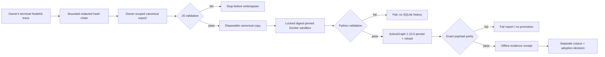

# NodeKit ActiveGraph offline canary

- **Status:** Experimental, offline, fail-closed, and non-authoritative
- **Decision date:** 2026-07-28
- **Implementation:** [`evals/activegraph/`](../../evals/activegraph/) and
  [`scripts/nodekit/runActiveGraphCanary.mjs`](../../scripts/nodekit/runActiveGraphCanary.mjs)
- **Upstream:** [yoheinakajima/activegraph](https://github.com/yoheinakajima/activegraph)

## Decision

NodeBench now has the smallest safe ActiveGraph integration slice discussed in
the July 25–28 NodeKit thread:

1. new owner-scoped execution traces append one immutable-while-retained,
   ordered, content-hashed `nodekit.run-event/v1` chain containing only bounded
   sensitivity-redacted projections;
2. an owner-scoped query exports a terminal chain as
   `nodekit.run-export/v1`;
3. a Node wrapper validates the source export before any canary write, stages a
   disposable copy, strips production credentials, and launches a digest-pinned
   Docker image with networking disabled, a read-only root, dropped
   capabilities, resource bounds, and one writable evidence mount;
4. the Python adapter validates the copy independently, writes an isolated
   SQLite event log, reloads it, and requires exact event-payload parity; and
5. the report is evidence only. It cannot answer, approve, mutate, or replace
   NodeBench state.

This is not a decision to adopt ActiveGraph as NodeBench's runtime, event store,
graph store, scheduler, or orchestration layer. Convex and the existing
NodeBench harness remain authoritative.

## What changed from the reconnaissance canary

The original lane characterized ActiveGraph with one synthetic graph-hop fork:
semantic-heavy and graph-heavy policies had to produce a deterministic winner
flip, inspectable traversal, diff, and persistence/reload parity.

That synthetic golden remains useful and unchanged in authority. A second lane
now consumes a real canonical NodeKit export contract. It deliberately does not
interpret or rewrite events into invented ActiveGraph domain objects. Each
verified NodeKit event is stored as the exact `nodekit_event` payload of an
ActiveGraph `nodekit.event`, then compared byte-for-data after a fresh reload.

This proves storage and replay parity for the exported sequence. It does not
prove that ActiveGraph should execute NodeBench decisions.

## Canonical export contract

### Immutable, bounded source

`backend/convex/schema.ts` defines `nodeKitRunEvents`. The repository exposes no
patch function for that table. Newly created owner-scoped execution traces
append:

- `run.started`;
- `span.started` and `span.completed`;
- `step.recorded`;
- `decision.recorded`;
- `verification.recorded`;
- `evidence.attached`;
- trace-bound `approval.requested`; and
- exactly one `run.completed` or `run.failed`.

Each event commits to:

- its run ID and contiguous sequence number;
- its type, nondecreasing timestamp, and
  `nodekit.safe-event-payload/v1` projection;
- the previous event's SHA-256 hash; and
- its own SHA-256 content hash over RFC 8785-compatible canonical JSON.

The append happens in the same Convex transaction as the owning mutation. A
failed append fails that mutation rather than silently producing incomplete
history.

The source payload is sensitivity-redacted before hashing and is never stored.
The stored projection contains only an event-specific allowlist of bounded
structural scalars plus the redacted source digest and byte count. Raw
`toolArgs`, span data, evidence and decision text, errors, and arbitrary
metadata are excluded. A redacted source is capped at 32 KiB, a stored
projection at 2 KiB, and a run at 256 events.

Explicit `span.started` and `span.completed` events form a checked lifecycle:
duplicate starts, completion without a start, and terminal runs with open spans
fail the owning transaction. Every nonterminal append must leave enough bounded
slots for all currently open span completions plus one terminal event.
`run.completed` requires payload status `completed`; `run.failed` requires
payload status `error`. `step.recorded` remains a self-contained completed step
and is not misrepresented as an open explicit span.

Only terminal events carry the 30-day expiry timestamp. The daily
`nodekit run-event retention` sweep queries terminal-type expiry indexes,
deletes only whole expired terminal histories within a 1,024-row mutation
budget, and schedules one bounded continuation while a backlog remains. A
running trace older than the same threshold is explicitly failed: open spans
receive error completions, the chain receives `run.failed`, and only then does
its retention clock begin. A corrupt stale chain is boundedly removed instead
of being converted into a forged complete receipt. An authenticated owner can
also call
`domains/operations/taskManager/nodeKitRunRetention:deleteOwnedNodeKitRunHistory`
for a terminal run. Deletion deliberately makes future export unavailable; it
never rewrites a retained chain.

### Owner-scoped terminal export

`domains/operations/taskManager/nodeKitRunExport:exportNodeKitRun` requires an
authenticated owner, a terminal trace, an exact owner/session/run match, a
contiguous valid chain of at most 256 events, balanced explicit spans, one final
terminal event, and a matching trace status.
It returns:

- session and trace metadata derived only from `run.started`, the terminal
  event, and immutable Convex IDs;
- the ordered event array;
- an explicit event-chain and span-lifecycle receipt;
- the event-chain head; and
- a SHA-256 hash over the complete export.

The same retained event chain therefore always produces the same export hash,
even if mutable session status, title, or completion fields later change.
Traces created before this contract, ownerless QA traces, expired histories,
and owner-deleted histories have no available canonical chain. They return the
truthful client-visible error code `run_history_unavailable`; the exporter does
not guess whether absence means legacy, expiry, or deletion and never
reconstructs events from mutable trace metadata. Boundary errors use Convex's
structured error protocol, while not-found and unauthorized traces remain
deliberately indistinguishable.

## Offline process boundary

The supported evaluator entrypoint is:

```powershell
$BuildMetadata = node scripts/nodekit/runActiveGraphCanary.mjs `
  --print-build-metadata | ConvertFrom-Json

docker build `
  --file evals/activegraph/Dockerfile `
  --tag nodebench-activegraph-canary:local `
  --build-arg "NODEBENCH_ACTIVEGRAPH_BUILD_INPUTS_SHA256=$($BuildMetadata.buildInputsHash)" `
  --build-arg "NODEBENCH_CANDIDATE_COMMIT=$($BuildMetadata.nodebenchCandidateCommit)" `
  --build-arg "NODEBENCH_ACTIVEGRAPH_UPSTREAM_SHA256=$($BuildMetadata.upstreamHash)" `
  evals/activegraph

$SandboxImage = docker image inspect `
  --format "{{.Id}}" `
  nodebench-activegraph-canary:local
$ImageAttestation = ".tmp\activegraph-canary\image-attestation.json"
node scripts/nodekit/runActiveGraphCanary.mjs `
  --attestation-output $ImageAttestation `
  --sandbox-image $SandboxImage
node scripts/nodekit/runActiveGraphCanary.mjs `
  --input .tmp\nodekit-export.json `
  --evidence-root .tmp\activegraph-canary\nodekit `
  --sandbox-image $SandboxImage `
  --image-attestation $ImageAttestation
```

The wrapper:

1. reads and verifies the source export before creating an evidence directory;
2. requires an immutable Docker image ID or repository digest plus a canonical
   image attestation binding the exact Dockerfile, dependency pins, source
   tree, `UPSTREAM.json`, and NodeBench candidate commit;
3. creates a new, exclusive run directory and canonical disposable copy;
4. starts Docker with `--network none`, `--read-only`, `--cap-drop ALL`,
   `no-new-privileges`, PID/CPU/memory limits, and only the run directory
   mounted at `/evidence`;
5. does not mount the source export or repository and passes no Convex, MCP,
   model, cloud, or application credentials;
6. recomputes the canonical build-input hash, verifies the candidate commit and
   audited upstream record, and inspects exact labels on the selected image;
7. requires the child to detect Docker, pinned ActiveGraph 1.10.0,
   `NODEBENCH_ACTIVEGRAPH_MODE=offline-observer`, and the full image-attestation
   environment;
8. accepts only a passing report bound to that image, attestation, run ID,
   export hash, event count, chain head, and canonical replayed-event digest;
9. bounds input, report, SQLite, child output, and child runtime; requires
   exactly three non-empty regular files; and reads only the SQLite header; and
10. rechecks both the source and disposable export bytes after execution.

The only allowed outputs are inside the selected evidence run directory:

```text
nodekit-run-export.json
activegraph.sqlite3
report.json
```

Existing run directories are never reused. Invalid or tampered exports fail
before Docker is spawned. Missing Docker, a mutable image reference, nonzero
child result, host-only Python invocation, extra artifact, symlink, empty file,
mutated export, or non-SQLite database fails closed and cannot become a pass.
The local attestation prevents accidental or arbitrary digest substitution; it
is not signed supply-chain provenance. An actor who controls both the Docker
daemon and the attestation file can forge matching labels, so any production
bridge would still require a trusted builder/signature policy.

## Authority boundary

| Surface                                 | Authority                                                 | Rule                                          |
| --------------------------------------- | --------------------------------------------------------- | --------------------------------------------- |
| NodeBench application and durable state | Owner-scoped Convex functions and tables                  | Canonical; no ActiveGraph dual-write          |
| `nodeKitRunEvents`                      | Bounded, redacted, immutable-while-retained owner history | Source of the exported facts                  |
| `nodekit.run-export/v1`                 | Immutable terminal-run transfer document                  | Read-only input to evaluators                 |
| ActiveGraph SQLite event log            | One disposable offline run                                | Local evaluator truth only                    |
| ActiveGraph graph projection            | Derived from that disposable log                          | Rebuildable and non-authoritative             |
| Replay report                           | Evaluation evidence                                       | Cannot drive answers, approvals, or mutations |
| Synthetic graph-hop report              | Library-characterization evidence                         | Separate from canonical run replay            |

“Event log is the source of truth” remains scoped to ActiveGraph's internal
replay model. It does not transfer authority away from NodeBench or Convex.

## Canary flow



## Upstream pin and current discussion

The canary installs exact direct pins:

- `activegraph==1.10.0`
- `jsonschema==4.26.0`
- `pytest==9.1.1`
- `rfc8785==0.1.4`

| Reference                     | Revision                                   | Use                                      |
| ----------------------------- | ------------------------------------------ | ---------------------------------------- |
| `v1.10.0` annotated tag object | `3fbcd8fc56a45ae68622d4e2b18a6d5844180527` | Release-tag provenance                   |
| `v1.10.0` release commit      | `148e12c2969f18fa12a1a3c2e75f3affd9aa0616` | Executable dependency contract           |
| Audited upstream `main`       | `8aedb1866cf5dce056af97529152ffd6f468a1ed` | Repository and issue inspection boundary |

The audited `main` revision and any features discussed upstream are provenance
and research data only; they confer no NodeBench authority. The evaluator does
not install a floating Git revision. `evals/activegraph/UPSTREAM.json` records
the release commit, annotated tag object, and inspected main revision
machine-readably.

At the pinned release, the upstream
[`CHANGELOG.md`](https://github.com/yoheinakajima/activegraph/blob/148e12c2969f18fa12a1a3c2e75f3affd9aa0616/CHANGELOG.md#1100--2026-07-12)
describes three v1.10 additions/changes: cooperative bounded drains through
`Runtime.run_quantum`, opt-in bounded `context.read` tracing, and loud rejection
of reserved top-level field collisions. This canary enables context-read
tracing only inside its disposable observer runtime. It does not adopt
`run_quantum`, ActiveGraph authority, or upstream reserved-field semantics for
NodeBench; those release notes are upstream data, while local tests and replay
receipts are the only evidence claimed here.

### Issue #67: mutable accepted payload

[ActiveGraph issue #67](https://github.com/yoheinakajima/activegraph/issues/67)
remains a production blocker. `Graph.emit()` can retain a caller-owned nested
payload in memory while SQLite stores its serialized value. The adapters
therefore deep-copy every accepted payload and test live/persisted/reloaded
parity.

That containment proves this evaluator boundary, not an upstream fix.
ActiveGraph cannot become production authority until either upstream provides
an immutable snapshot boundary or NodeBench separately reviews and proves a
complete immutability adapter.

### Issue #70: Temporal proposal

[ActiveGraph issue #70](https://github.com/yoheinakajima/activegraph/issues/70)
is research input, not an architecture decision. Its maintainer acceptance,
async ordering, deterministic replay, truncation, and fork semantics remain
unresolved. NodeBench's existing Temporal stack does not answer those upstream
questions. This slice adds no Temporal dependency.

## Acceptance gates

### Gate 1 — synthetic mechanics: implemented

The existing golden must keep proving deterministic fork/diff behavior,
explicit topology traversal, winner-flip explanation, persistence/reload
parity, canonical report bytes, and issue #67 containment.

### Gate 2 — canonical export: implemented for new owner-scoped traces

The TypeScript contract tests must prove ordering, per-event hashes,
whole-export stability, redacted/bounded payloads, lifecycle completeness,
retention boundaries, and fail-closed tamper behavior. The wrapper tests must
prove disposable-copy staging, credential stripping, immutable-image
enforcement, locked Docker arguments, source immutability, exact artifact sets,
exclusive evidence directories, and failure propagation. The Python tests must
prove independent validation, host-execution refusal, and real ActiveGraph
persistence/reload parity through the explicit unit-test seam.

The Docker Desktop daemon was unavailable in the implementation checkout, so a
real container launch was not fabricated as proof. Runtime invocation remains
fail-closed until Docker is running and the locked image has been built; the
exact build/replay commands are in `evals/activegraph/README.md`.

This gate does not backfill legacy traces and does not authorize production
adoption.

### Gate 3 — representative corpus: deferred

Replay roughly 20 representative owner-authorized exports. Stop if:

- any export is incomplete or cannot be represented without reconstruction;
- persistence/reload parity differs;
- median end-to-end latency exceeds 2× the equivalent existing harness; or
- the resulting graph/diff evidence adds no material explanatory value.

Passing Gate 3 authorizes only a separate adoption-or-rejection ADR.

### Gate 4 — production bridge: not authorized

A production bridge would still require a threat model, owner and tenant
isolation proof, issue #67 disposition, migration and rollback plans, and
explicit approval. No result from this canary may automatically promote that
path.

## NodeKit alignment

The evaluator is declared as `nodebench-activegraph-canary` in the flat v1
`nodeagent.yaml` evaluation plan. The still-valid manifest, policy-path, pack,
evaluation-binding, and configured-Convex-path changes from draft PR #592 were
reapplied selectively to current `main`.

The conflicted PR branch and its generated `.nodeagent/**` snapshot were not
merged. Compiler output must be regenerated from the current tree when needed.

## Explicit non-goals

This slice does not add:

- a live ActiveGraph `EventSink`;
- a TypeScript ActiveGraph runtime;
- an MCP ingestion path;
- a Temporal backend;
- a production worker or dual-write;
- a corpus-based adoption decision; or
- any ActiveGraph role in user-visible answers or approval decisions.

## Reproduction

Use the pinned virtual-environment setup and exact test commands in
[`evals/activegraph/README.md`](../../evals/activegraph/README.md).

## Related

- [ActiveGraph v1.10.0 release](https://github.com/yoheinakajima/activegraph/releases/tag/v1.10.0)
- [ActiveGraph issue #67](https://github.com/yoheinakajima/activegraph/issues/67)
- [ActiveGraph issue #70](https://github.com/yoheinakajima/activegraph/issues/70)
- [NodeBench × NodeKit standard repository tree](./STANDARD_REPO_TREE.md)
- [Draft NodeBench PR #592](https://github.com/HomenShum/NodeBenchAI/pull/592)
